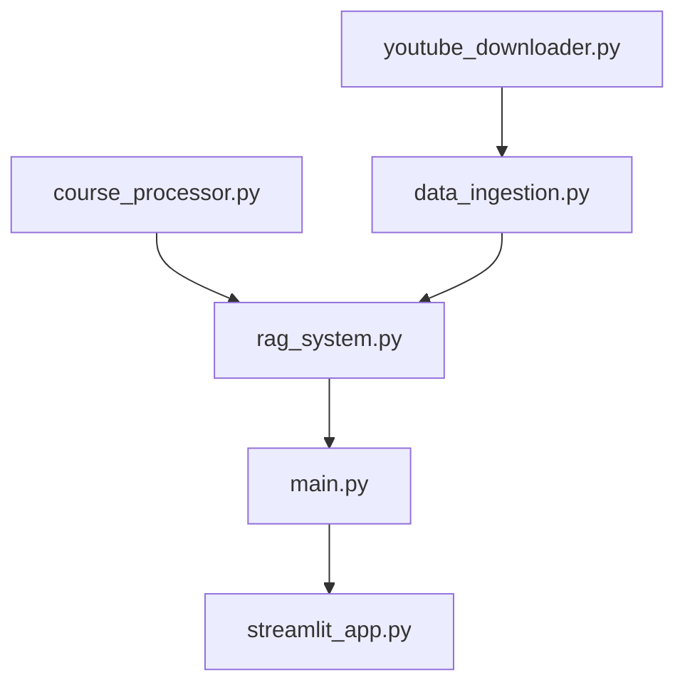

# RAG Based AI Tutor

A powerful Retrieval-Augmented Generation (RAG) system that allows you to chat with YouTube video transcripts and get personalized course recommendations. Ask questions about video content and receive AI-powered answers with clickable source citations and relevant course suggestions.

## 🎯 Features

- **🎥 YouTube Transcript Download**: Automatically download transcripts from YouTube playlists
- **🧠 Smart Text Processing**: Convert VTT subtitles to clean, searchable text format
- **🔍 Vector Search**: Use ChromaDB with Ollama embeddings for semantic search
- **🤖 AI-Powered Responses**: Generate contextual answers using Groq's LLaMA model
- **🎓 Course Recommendations**: Get relevant course suggestions from Kaggle datasets
- **💬 Interactive Web Interface**: Modern Streamlit frontend with clickable elements
- **📖 Clickable References**: Click sources to view full transcript chunks in dialogs
- **🔎 Clickable Search Results**: Expandable search results with full content viewing
- **⚙️ Customizable Settings**: Adjust number of results and course recommendations
- **📚 Source Citations**: Track which videos your answers come from
- **🚀 FastAPI Backend**: RESTful API for programmatic access

## 🏗️ Architecture

```
┌─────────────────┐    ┌─────────────────┐    ┌─────────────────┐
│   YouTube       │    │   Text          │    │   ChromaDB      │
│   Transcripts   │───▶│   Processing    │───▶│   Vector Store  │
│   (VTT files)   │    │   (Clean Text)  │    │   (Embeddings)  │
└─────────────────┘    └─────────────────┘    └─────────────────┘
                                                        │
┌─────────────────┐    ┌─────────────────┐    ┌─────────────────┐
│   Kaggle        │    │   Course        │    │   Course        │
│   Course CSV    │───▶│   Processing    │───▶│   ChromaDB      │
│                 │    │                 │    │   Collection    │
└─────────────────┘    └─────────────────┘    └─────────────────┘
                                                        │
┌─────────────────┐    ┌─────────────────┐    ┌─────────────────┐
│   Streamlit     │    │   FastAPI       │    │   RAG System    │
│   Frontend      │◀──▶│   Backend       │◀──▶│   (Query+LLM)   │
└─────────────────┘    └─────────────────┘    └─────────────────┘
                                                        │
                       ┌─────────────────┐    ┌─────────────────┐
                       │   Ollama        │    │   Groq API      │
                       │   Embeddings    │    │   LLaMA Model   │
                       └─────────────────┘    └─────────────────┘
```

## 🚀 Quick Start

### Prerequisites

- **Python 3.8+**
- **[Ollama](https://ollama.ai)** installed and running
- **[yt-dlp](https://github.com/yt-dlp/yt-dlp)** for downloading transcripts
- **Groq API key** (get it from [groq.com](https://groq.com))

### 1. Clone and Setup

```bash
git clone <your-repo-url>
cd youtube-transcript-rag
pip install -r requirements.txt
```

### 2. Install System Dependencies

```bash
# Install yt-dlp for YouTube downloads
pip install yt-dlp

# Install and start Ollama (visit ollama.ai for instructions)
# Pull the embedding model
ollama pull nomic-embed-text
```

### 3. Configure Environment

Create a `.env` file:

```bash
cp .env.example .env
# Edit .env and add your Groq API key
GROQ_API_KEY=your_groq_api_key_here
```

### 4. Automated Setup (Recommended)

```bash
# Complete setup with playlist
python setup.py --playlist-url "YOUR_YOUTUBE_PLAYLIST_URL"

# Or interactive setup
python setup.py
```

### 5. Manual Setup (Alternative)

```bash
# 1. Download and process YouTube transcripts
python youtube_downloader.py

# 2. Ingest transcript data
python data_ingestion.py

# 3. [Optional] Process course recommendations
# Place your Kaggle course CSV at data/courses.csv first
python course_processor.py

# 4. Start backend (in one terminal)
uvicorn main:app --reload

# 5. Start frontend (in another terminal)
streamlit run streamlit_app.py
```

## 📁 Project Structure

```
youtube-transcript-rag/
├── youtube_downloader.py      # Download & process YouTube transcripts
├── data_ingestion.py          # Process and store transcripts in ChromaDB
├── course_processor.py        # Process Kaggle course datasets
├── rag_system.py              # Core RAG implementation with courses
├── main.py                    # FastAPI backend
├── streamlit_app.py           # Streamlit frontend
├── setup.py                   # Automated setup script
├── requirements.txt           # Python dependencies
├── .env.example              # Environment template
├── README.md                 # This file
└── data/
    ├── raw_transcripts/      # Downloaded VTT files
    ├── processed_transcripts/ # Cleaned text files
    └── courses.csv           # [Optional] Kaggle course dataset
```

## 🎮 Usage

### Web Interface

1. **Open your browser** to `http://localhost:8501`
2. **Check system status** in the sidebar
3. **Adjust settings** using the sliders:
   - Number of transcript results (1-10)
   - Course recommendations (1-20)
4. **Ask questions** in the chat interface
5. **Click sources** to view full transcript chunks
6. **Use search** to find specific content
7. **Click course names** to open course URLs

### Key UI Features

- **📖 Clickable Sources**: Click "View" buttons to see full transcript content
- **🎓 Course Recommendations**: Automatically suggested after each query
- **🔍 Enhanced Search**: Search transcripts with full-text preview
- **📊 Statistics Dashboard**: Track your usage and system metrics
- **💾 Download History**: Export your chat conversations

### API Usage

```bash
# Health check
curl http://localhost:8000/

# Query with course recommendations
curl -X POST http://localhost:8000/query \
  -H "Content-Type: application/json" \
  -d '{
    "query": "What is machine learning?",
    "n_results": 5,
    "n_course_recs": 3
  }'

# Search transcript content
curl -X POST http://localhost:8000/search \
  -H "Content-Type: application/json" \
  -d '{"query": "neural networks", "n_results": 5}'

# Get course recommendations only
curl -X POST http://localhost:8000/course-recommendations \
  -H "Content-Type: application/json" \
  -d '{"query": "python programming", "n_course_recs": 5}'

# Get available videos
curl http://localhost:8000/videos

# Get course collection info
curl http://localhost:8000/course-info
```

## 🔧 Configuration

### Environment Variables

| Variable          | Description            | Default                  |
| ----------------- | ---------------------- | ------------------------ |
| `GROQ_API_KEY`    | Your Groq API key      | **Required**             |
| `OLLAMA_BASE_URL` | Ollama server URL      | `http://localhost:11434` |
| `EMBEDDING_MODEL` | Ollama embedding model | `nomic-embed-text`       |
| `CHROMA_DB_PATH`  | ChromaDB storage path  | `./chroma_db`            |
| `API_HOST`        | FastAPI host           | `0.0.0.0`                |
| `API_PORT`        | FastAPI port           | `8000`                   |

### Course Dataset Format

Your Kaggle course CSV should have columns like:

- `course_name` or `title` - Course title
- `course_url` or `url` - Course URL
- Additional columns are ignored

Example CSV structure:

```csv
course_name,course_url
"Introduction to Machine Learning","https://example.com/ml-course"
"Python for Data Science","https://example.com/python-course"
"Deep Learning Fundamentals","https://example.com/dl-course"
```

### Customization Options

- **Chunk Size**: Modify `chunk_size` in `data_ingestion.py` (default: 1000 chars)
- **Overlap**: Adjust `chunk_overlap` for better context (default: 200 chars)
- **Results Count**: Change default `n_results` in queries (default: 5)
- **Course Recommendations**: Adjust default `n_course_recs` (default: 3)
- **LLM Model**: Update model in `rag_system.py` (default: `llama3-8b-8192`)
- **Temperature**: Modify LLM temperature for creativity vs accuracy

## 🐛 Troubleshooting

### Common Issues

**1. "RAG system not initialized"**

```bash
# Solution: Ensure ChromaDB has been populated
python data_ingestion.py
# Check if transcripts exist in data/processed_transcripts/
```

**2. "Error getting embedding"**

```bash
# Solution: Verify Ollama is running and model is installed
ollama list
ollama pull nomic-embed-text
ollama serve  # If not running
```

**3. "Groq API error"**

```bash
# Solution: Check your API key and quota
# Verify .env file has correct GROQ_API_KEY
# Check account limits at groq.com
```

**4. "No transcript files found"**

```bash
# Solution: Run transcript download first
python youtube_downloader.py
# Or check if yt-dlp is installed
pip install yt-dlp
```

**5. "Course recommendations not showing"**

```bash
# Solution: Add course dataset
# Place courses.csv in data/ folder
python course_processor.py
```

**6. "Connection refused (port 8000)"**

```bash
# Solution: Start the FastAPI backend
uvicorn main:app --reload
# Check if port is already in use
lsof -i :8000
```

### Debug Mode

Enable detailed logging by setting environment variable:

```bash
export LOG_LEVEL=DEBUG
```

### Performance Tips

1. **Reduce chunk size** for faster embedding generation
2. **Lower n_results** for quicker responses
3. **Use SSD storage** for ChromaDB for better performance
4. **Increase RAM** if processing large video collections
5. **Use GPU** with Ollama for faster embeddings (if available)

## 🔄 Development Workflow

### Adding New Features

1. **Backend changes**: Modify `main.py` and `rag_system.py`
2. **Frontend changes**: Update `streamlit_app.py`
3. **Data processing**: Extend `data_ingestion.py` or `course_processor.py`
4. **Testing**: Run individual modules with `python filename.py`

### File Dependencies



## 📊 System Requirements

### Minimum Requirements

- **RAM**: 4GB
- **Storage**: 2GB free space
- **CPU**: 2 cores
- **Internet**: Stable connection for API calls

### Recommended Requirements

- **RAM**: 8GB+
- **Storage**: 10GB+ SSD
- **CPU**: 4+ cores
- **GPU**: Optional (for faster Ollama embeddings)

### Supported Platforms

- ✅ **Linux** (Ubuntu 20.04+)
- ✅ **macOS** (10.15+)
- ✅ **Windows** (10+)
- ✅ **Docker** (containerized deployment)

## 🚀 Advanced Usage

### Batch Processing

Process multiple playlists:

```bash
# Create a script to process multiple playlists
for url in playlist_urls.txt; do
    python youtube_downloader.py --url "$url"
done
python data_ingestion.py
```

### API Integration

Use the REST API in your applications:

```python
import requests

# Query the system
response = requests.post('http://localhost:8000/query', json={
    'query': 'explain neural networks',
    'n_results': 5,
    'n_course_recs': 3
})

result = response.json()
print(f"Answer: {result['response']}")
print(f"Sources: {len(result['sources'])}")
print(f"Courses: {len(result['course_recommendations'])}")
```

### Custom Embeddings

Use different embedding models:

```python
# In rag_system.py, change embedding_model
rag = YouTubeTranscriptRAG(embedding_model="your-custom-model")
```

## 📈 Monitoring and Analytics

### Usage Statistics

The system tracks:

- Query count and response times
- Source utilization
- Course recommendation accuracy
- User interaction patterns

### Performance Metrics

Monitor via the Streamlit interface:

- Total documents processed
- Average query response time
- Database size and growth
- API call success rates

## 🤝 Contributing

We welcome contributions! Please see our contributing guidelines:

1. **Fork** the repository
2. **Create** a feature branch
3. **Make** your changes
4. **Test** thoroughly
5. **Submit** a pull request

### Development Setup

```bash
git clone <your-fork>
cd youtube-transcript-rag
pip install -r requirements.txt
pip install -r requirements-dev.txt  # Additional dev dependencies
```

## 📝 License

This project is licensed under the MIT License - see the [LICENSE](LICENSE) file for details.

## 🙏 Acknowledgments

- **[Ollama](https://ollama.ai)** for local embeddings
- **[Groq](https://groq.com)** for fast LLM inference
- **[ChromaDB](https://www.trychroma.com)** for vector storage
- **[Streamlit](https://streamlit.io)** for the web interface
- **[yt-dlp](https://github.com/yt-dlp/yt-dlp)** for YouTube downloads
- **[LangChain](https://langchain.com)** for document processing

## 📞 Support

- **Documentation**: This README and inline code comments
- **Issues**: Use GitHub Issues for bug reports
- **Discussions**: Use GitHub Discussions for questions
- **Email**: Contact the maintainers for urgent issues

---

<div align="center">

### 🎉 **Ready to chat with your YouTube videos?**

**Start your journey with intelligent video content exploration!**

Made with ❤️ for the AI community

</div>
