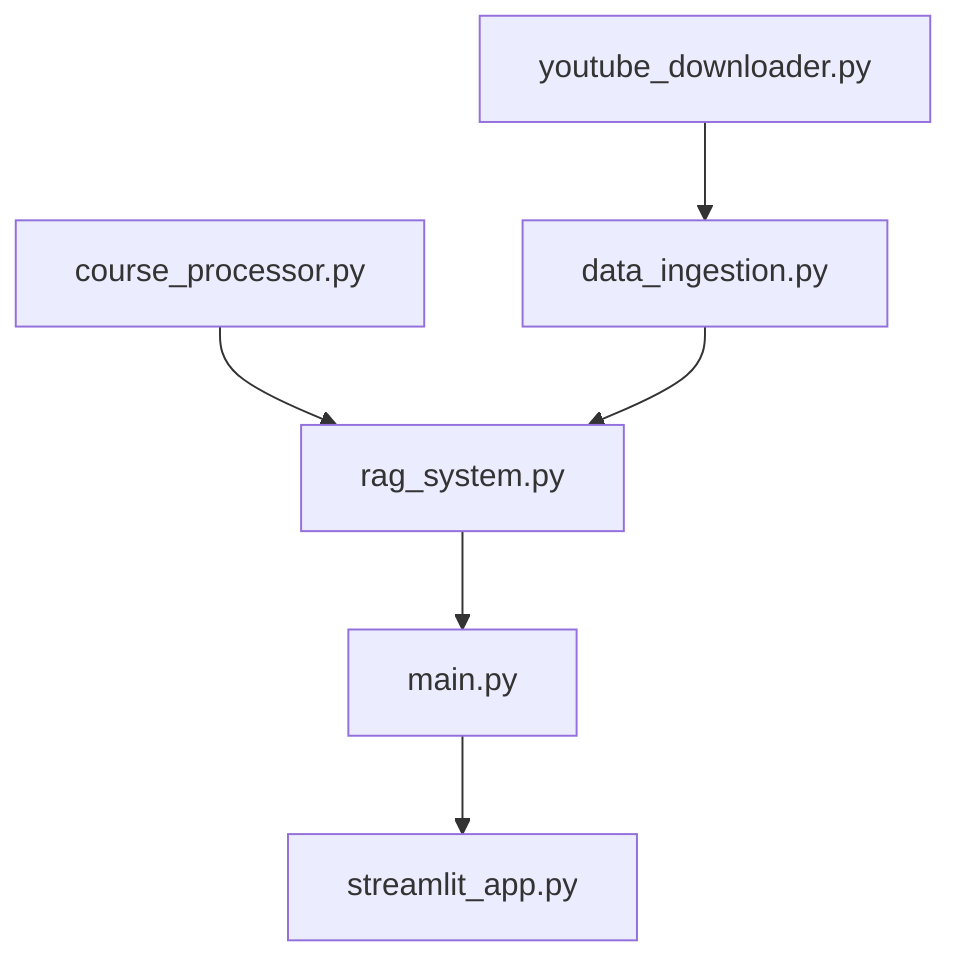

# RAG Based AI Tutor

A powerful Retrieval-Augmented Generation (RAG) system that allows you to chat with YouTube video transcripts and get personalized course recommendations. Ask questions about video content and receive AI-powered answers with clickable source citations and relevant course suggestions.

## Features

* **YouTube Transcript Download**: Automatically download transcripts from YouTube playlists
* **Smart Text Processing**: Convert VTT subtitles to clean, searchable text format
* **Vector Search**: Use ChromaDB with Ollama embeddings for semantic search
* **AI-Powered Responses**: Generate contextual answers using Groq's LLaMA model
* **Course Recommendations**: Get relevant course suggestions from Kaggle datasets
* **Interactive Web Interface**: Modern Streamlit frontend with clickable elements
* **Clickable References**: Click sources to view full transcript chunks in dialogs
* **Clickable Search Results**: Expandable search results with full content viewing
* **Customizable Settings**: Adjust number of results and course recommendations
* **Source Citations**: Track which videos your answers come from
* **FastAPI Backend**: RESTful API for programmatic access

## Architecture

```
┌─────────────────┐    ┌─────────────────┐    ┌─────────────────┐
│   YouTube       │    │   Text          │    │   ChromaDB      │
│   Transcripts   │───▶│   Processing    │───▶│   Vector Store  │
│   (VTT files)   │    │   (Clean Text)  │    │   (Embeddings)  │
└─────────────────┘    └─────────────────┘    └─────────────────┘
                                                        │
┌─────────────────┐    ┌─────────────────┐    ┌─────────────────┐
│   Kaggle        │    │   Course        │    │   Course        │
│   Course CSV    │───▶│   Processing    │───▶│   ChromaDB      │
│                 │    │                 │    │   Collection    │
└─────────────────┘    └─────────────────┘    └─────────────────┘
                                                        │
┌─────────────────┐    ┌─────────────────┐    ┌─────────────────┐
│   Streamlit     │    │   FastAPI       │    │   RAG System    │
│   Frontend      │◀──▶│   Backend       │◀──▶│   (Query+LLM)   │
└─────────────────┘    └─────────────────┘    └─────────────────┘
                                                        │
                       ┌─────────────────┐    ┌─────────────────┐
                       │   Ollama        │    │   Groq API      │
                       │   Embeddings    │    │   LLaMA Model   │
                       └─────────────────┘    └─────────────────┘
```

## Quick Start

### Prerequisites

* **Python 3.8+**
* [Ollama](https://ollama.ai) installed and running
* [yt-dlp](https://github.com/yt-dlp/yt-dlp) for downloading transcripts
* Groq API key (get it from [groq.com](https://groq.com))

### 1. Clone and Setup

```bash
git clone <your-repo-url>
cd youtube-transcript-rag
pip install -r requirements.txt
```

### 2. Install System Dependencies

```bash
pip install yt-dlp
# Install and start Ollama, then pull the embedding model
ollama pull nomic-embed-text
```

### 3. Configure Environment

Create a `.env` file:

```bash
cp .env.example .env
# Edit .env and add your Groq API key
GROQ_API_KEY=your_groq_api_key_here
```

### 4. Automated Setup (Recommended)

```bash
python setup.py --playlist-url "YOUR_YOUTUBE_PLAYLIST_URL"
# Or interactive setup
python setup.py
```

### 5. Manual Setup (Alternative)

```bash
# 1. Download and process YouTube transcripts
python youtube_downloader.py

# 2. Ingest transcript data
python data_ingestion.py

# 3. Optional: Process course recommendations
python course_processor.py

# 4. Start backend (in one terminal)
uvicorn main:app --reload

# 5. Start frontend (in another terminal)
streamlit run streamlit_app.py
```

## Project Structure

```
youtube-transcript-rag/
├── youtube_downloader.py
├── data_ingestion.py
├── course_processor.py
├── rag_system.py
├── main.py
├── streamlit_app.py
├── setup.py
├── requirements.txt
├── .env.example
├── README.md
└── data/
    ├── raw_transcripts/
    ├── processed_transcripts/
    └── courses.csv
```

## Usage

### Web Interface

1. Open browser at `http://localhost:8501`
2. Check system status in the sidebar
3. Adjust number of transcript results and course recommendations
4. Ask questions in the chat interface
5. Click sources to view full transcript chunks
6. Use search to find specific content
7. Click course names to open course URLs

### API Usage

```bash
# Health check
curl http://localhost:8000/

# Query with course recommendations
curl -X POST http://localhost:8000/query \
  -H "Content-Type: application/json" \
  -d '{"query": "What is machine learning?", "n_results": 5, "n_course_recs": 3}'

# Search transcript content
curl -X POST http://localhost:8000/search \
  -H "Content-Type: application/json" \
  -d '{"query": "neural networks", "n_results": 5}'
```

## Configuration

### Environment Variables

| Variable          | Description            | Default                  |
| ----------------- | ---------------------- | ------------------------ |
| `GROQ_API_KEY`    | Your Groq API key      | Required                 |
| `OLLAMA_BASE_URL` | Ollama server URL      | `http://localhost:11434` |
| `EMBEDDING_MODEL` | Ollama embedding model | `nomic-embed-text`       |
| `CHROMA_DB_PATH`  | ChromaDB storage path  | `./chroma_db`            |
| `API_HOST`        | FastAPI host           | `0.0.0.0`                |
| `API_PORT`        | FastAPI port           | `8000`                   |

### Course Dataset Format

CSV should have columns like:

* `course_name` or `title` - Course title
* `course_url` or `url` - Course URL

Example:

```csv
course_name,course_url
"Introduction to Machine Learning","https://example.com/ml-course"
"Python for Data Science","https://example.com/python-course"
```

### Customization Options

* `chunk_size` and `chunk_overlap` in `data_ingestion.py`
* Default `n_results` and `n_course_recs` in queries
* Update LLM model and temperature in `rag_system.py`

## Troubleshooting

* Ensure ChromaDB is populated before querying
* Verify Ollama is running and models are installed
* Check Groq API key and quota
* Download transcripts before ingestion
* Place courses.csv in data/ if course recommendations don’t appear
* Start FastAPI backend if connection refused

### File Dependencies



## Possible Extensions

* Batch processing multiple playlists
* Use custom embeddings

## Acknowledgments

* [Ollama](https://ollama.ai)
* [Groq](https://groq.com)
* [ChromaDB](https://www.trychroma.com)
* [Streamlit](https://streamlit.io)
* [yt-dlp](https://github.com/yt-dlp/yt-dlp)
* [LangChain](https://langchain.com)
